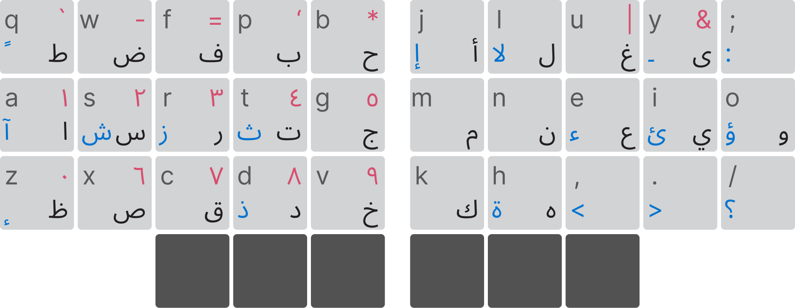
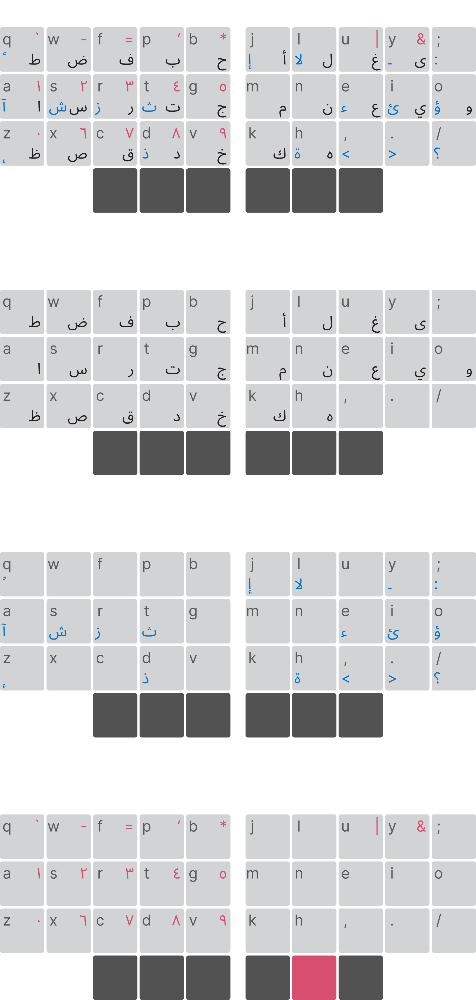

colemak-dhas-ar keyboard (code name Gahbz)
==============



<details>ت



</details>

> This image depects a 36 Ortholinear split keyboard that uses a mod version of Colemak-dh

Who is this for?
----------------

- Someone who [still](https://www.reddit.com/r/theprimeagen/comments/1ue7zv9/lead_engineer_just_got_rid_of_his_keyboard/) owns a [keyboard](https://x.com/JarodLevy/status/2071566721110970528) with limited numbers of keys like 36 keys or less. *and*
- Who uses *English* primarily and professionally and want to benefits from the alternative layouts [ex: Colemak, Dvorak ...] Other than `QWERTY` 
- Yet also speaks *Arabic* and found that the only optimized *Arabic* layout was indeed `QWERTY` and by switching to other layout looses this optimization. *and*
- Who is not trying to breaking a world speed typing record.

> Too specific 😂?

This repo serve as one example of how to tackle this problem.

It does so with punch of tricks:
1. Matching the English phonetics, ex: B : ب
2. Heavy use of the shift modifire to reach other letters that are opposite to it, ex: Shift + ذ = د
3. Making up rules (seriously) that when followed gives a consistant results.
4. Following the ethos of alternative layout for ergonomity with heavy use of the homerow.

> [!WARNING]
> I only tested it on a custom Colemak-dh - but it might work on any layout

       
The Theory
----------

### The problem with Arabic

If you switched to a different layout, you will have to move keys around, the OS doesnt diffrentiate between the letters, it deals with keycode, and it's up to the OS to print the letter based on the OS selected language.  
This means when you move the letter P you also moving the letter خ.

For example if you decided to pick up Colemak-dh,

You will go from (`QWERTY`):  
| <kbd>Q</kbd> ض | <kbd>W</kbd> ص | <kbd>E</kbd> ث | <kbd>R</kbd> ق | <kbd>T</kbd> ف | <kbd>Y</kbd> غ | <kbd>U</kbd> ع | <kbd>I</kbd> ه | <kbd>O</kbd> ح | <kbd>P</kbd> ج | <kbd>[</kbd> د |
| --- | --- | --- | --- | --- | --- | --- | --- | --- | --- | --- |
| <kbd>A</kbd> ش | <kbd>S</kbd> س | <kbd>D</kbd> ي | <kbd>F</kbd> ب | <kbd>G</kbd> ل | <kbd>H</kbd> ا | <kbd>J</kbd> ت | <kbd>K</kbd> ن | <kbd>L</kbd> م | <kbd>;</kbd> ك | <kbd>'</kbd> ط |
| <kbd>Z</kbd> ئ | <kbd>X</kbd> ء | <kbd>C</kbd> ؤ | <kbd>V</kbd> ر | <kbd>B</kbd> لا | <kbd>N</kbd> ى | <kbd>M</kbd> ة | <kbd>,</kbd> و | <kbd>.</kbd> ز | <kbd>/</kbd> ظ | |


To (in `Colemak-dh`)
| <kbd>Q</kbd> ض | <kbd>W</kbd> ص | <kbd>F</kbd> ب | <kbd>P</kbd> ح | <kbd>B</kbd> لا | <kbd>J</kbd> ت | <kbd>L</kbd> م | <kbd>U</kbd> ع | <kbd>Y</kbd> غ | <kbd>;</kbd> ك | <kbd>[</kbd> د |
| --- | --- | --- | --- | --- | --- | --- | --- | --- | --- | --- |
| <kbd>A</kbd> ش | <kbd>R</kbd> ق | <kbd>S</kbd> س | <kbd>T</kbd> ف | <kbd>G</kbd> ل | <kbd>M</kbd> ة | <kbd>N</kbd> ى | <kbd>E</kbd> ث | <kbd>I</kbd> ه | <kbd>O</kbd> خ | <kbd>'</kbd> ط |
| <kbd>Z</kbd> ئ | <kbd>X</kbd> ء | <kbd>C</kbd> ؤ | <kbd>D</kbd> ي | <kbd>V</kbd> ر | <kbd>K</kbd> ن | <kbd>H</kbd> ا | <kbd>,</kbd> و | <kbd>.</kbd> ز | <kbd>/</kbd> ظ | |

Yeah; i gave that a try. Arabic with Colemak-dh (or any alternative layouts) is a nightmare.

This makes the act of moving to another layout very costly for Arabic speaking individuals like me, from the time i moved to Colemak-dh i could only type in arabic from my phone!.

### Why Arabic is optimized for `QWERTY`?

It feels incredibly organized at first glance, right? Your eyes trace the layout and see perfect visual pairs and logical clusters grouped together: `ض ص`, `ف ق`, `ع غ`, `خ ح ج`, and `ش س`.

While pairing letters like ش and س looks neat, it’s an ergonomic trap.   
Because similar-looking letters are crammed onto adjacent keys, you rarely get to ["roll" over](https://en.wikipedia.org/wiki/Key_rollover) them. Instead, a single finger is forced to rapidly stutter and jump all over the place just to execute common letter combinations. It’s the illusion of order masking QWERTY's classic, chaotic mechanics.

My solution
-----------

First of all Arabic is 28 letters plus other goodies called [diacritics](https://en.wikipedia.org/wiki/Arabic_diacritics).

If we tried to match pairs we will quickly find that only some letters will match phonetically.

Enter [Arabizi](https://en.wikipedia.org/wiki/Arabizi), i do type in arabizi 80% of the time when im communicating in chat in Arabic.  
Basically i want to reuse this skill, where if i want to say `جهبذ` i type `gahbz`.

There are clever softwares ( [example](https://chromewebstore.google.com/detail/araflip/fknappimkkfpopcnklaoooodeanfabel), [example](https://arxiv.org/pdf/1912.01218) ) that attempted to take this a step further, where you get to type `gahbz` it prints `جهبذ`.  
I'd even think training an LLM to do so would be a fun exercise.

My critisizim on not using a chrome extension, keyboards are a plug and play, installing a specialized software should be optional or to be avoided completely.  
Google Gboard approach is the closest thing to a frictionless arabizi to arabic, yet other OSs like Windows doesnt have this specific feature.

In a perfect world i'd find arabizi in every OS, but why wait, the following is not perfect because you are installing a software, but it's the closest thing to the gboard experience.

Here we are using a software called [Keyman](https://keyman.com/), as other attack angles have their own limitation, firmwares like QMK or ZMK do not communicate back and forth with the OS to sinff out the selected language, and if we naively switched between 2 layers when attempting to switch between languages (ex: Super + space = switch language and switch keyboard layer) will get out of sync quickly if the OS decided to change the language as they do.

The unique approach of keyman that it is simply another language you'd install and forget about.
Switching between the languages is simple and it works on the OS level

> [!WARNING]
> just dont type your passwords with it

Other approaches would be to take a page from the [Chorded keyboards](https://en.wikipedia.org/wiki/Chorded_keyboard) book where they already do this with even fewer keys, and honestly im tempted to give it a try, i truly think it's a viable path with speed of thought output.

For now i'll stick to keyman, it's was frictionless for my needs, and maybe i'll explore the chorded path later as it has a hardware barier.

Moving on
---------

The following table is from this [study](https://met.guc.edu.eg/Repository/Faculty/Publications/384/0004936.pdf) where they are showing Arabic Chat Alphabet (ACA) and their corresponding Arabic letters.

| Type | IPA | Arabic | SAMPA | ACA | my guess |
| ---- | --- | ------ | ----- | --- | --- |
| Consonant | ʔ | ء(ق)  | ? | 2, ’ | |
|           | b | ب    | b | b | b |
|           | p | ب    | p | p | |
|           | t | ت (ث)  | t | t | t |
|           | g | ج    | g | g, j | g |
|           | Ʒ | ج    | Z | j | |
|           | ħ | ح    | X\ | 7 | h |
|           | x | خ    | x | kh, 5, 7’ | |
|           | d | د (ذ)  | d | d | d |
|           | r | ر    | r | r | r |
|           | z | ز (ذ)  | z | z | z |
|           | s | س (ث)  | s | s | s |
|           | ʃ | ش  | S | sh | |
|           | Ş | ص  | s’ | s, 9 | |
|           | ḑ | ض (ظ)  | d’ | d, 9’ | |
|           | ṱ | ط  | t’ | t, 6 | |
|           | ᶎ | ظ (ض)  | D’ | z, 6’ | |
|           | ʕ | ع  | ?\ | 3 | |
|           | ɣ | غ  | G | gh, 3’ | |
|           | f | ف  | f | f | f |
|           | v | ف  | v | v | |
|           | q | ق  | q | q, 8, 9 | q |
|           | k | ك  | k | k | k |
|           | l | ل  | l | l | l |
|           | m | م  | m | m | m |
|           | n | ن  | n | n | n |
|           | h | ه  | h | h | h |
|           | w | و  | w | w | |
|           | j | ي  | j | y | |
| Vowel     | a | ـَ  | a | a | |
|           | ɑ | ـَ  | A | a | |
|           | i | ـِ  | i | i, e | |
|           | e | ـِ  | e | i, e | |
|           | u | ـُ  | u | u, o | |
|           | o | ـُ  | o | u, o | o |

> [!WARNING]
> Rule ahead

Taking this table as a reference, here's my attempt to match Arabic to English:

| EN | AR | Possible stretch |
|--- | ---| --- |
| A  | ا | |
| B  | ب | |
| C  |   | ص |
| D  | د | |
| E  | ى | |
| F  | ف | |
| G  | ج | |
| H  | ه | |
| I  | ي | |
| J  |  | ش |
| K  | ك | |
| L  | ل | |
| M  | م | |
| N  | ن | |
| O  | و | |
| P  |  | |
| Q  | ق | |
| R  | ر | |
| S  | س | |
| T  | ت | |
| U  |  |   |
| V  |  |   |
| W  |  |   |
| X  |  |   |
| Y  |  |   |
| Z  | ز | |
|    | ث | |
|    | ح | |
|    | خ | |
|    | ذ | |
|    | ش | |
|    | ص | |
|    | ض | |
|    | ط | |
|    | ظ | |
|    | ع | |
|    | غ | |

This leaves many unmached pairs, and just looks sad.  
Even in `QWERTY` we find that the 28 letters of arabic dont fit 1:1 to the english ones, you'd find ك with :; key.
So what if we modefied the goal, from match 1:1 to make it discoverable while using English as the base faoundation.  

Keyman gives us the ability to print a leter, but while the Shift modifier is held, we print another.

> [!WARNING]
> New rule ahead

This is the basis of the second trick here, why not print a letter, but when we have shift pressed, we print it's opposite similar?

The following will introduce an attempt:

| EN | AR | Shift + AR | a match |
| -- | -- | -- | -- |
| A | ا | أ | ✅ |
| B | ب |  | ✔️ |
| C | ص | ض | ⚠️ |
| D | د | ذ | ✅ |
| E | ع | غ | ✔️ |
| F | ف | ق | ✅ |
| G | ج |  | ✔️ |
| H | ه | ة | ✅ |
| I | ى | ي | ✅ |
| J |   |  |   |
| K | ك |  | ✔️ |
| L | ل |  | ✔️ |
| M | م |  | ✔️ |
| N | ن |  | ✔️ |
| O | و | ؤ | ✅ |
| P | ط | ظ | ❌ |
| Q | | | |
| R | ر | ز | ✅ |
| S | س | ش | ✅ |
| T | ت |  | ✔️ |
| U |  |  | |
| V |  |  | |
| W |  |  | |
| X | ح | خ | ❌ |
| Y | ء | ئ | ❌ |
| Z | ث |  | ✔️ |

- Thats 8 perfect matches ✅ the phonetics **and** the modifier version match as it's direct opposite (ex: S: س ش), thats 16 letters down.
- Some letters has no modifire version like ب ك ل م, although i was thinking about using پ but i know i'll never actually use it.
- Some has many other matching that choosing one will not sound/feel natural like ج will the modifier version be خ or ح?. but they have a phonetic match to the English letter, so not a total loss here, so in total we have 
- Some are total hacks, like C : ص, this is a streatch, but it kinda work, same for E : ع but it's a kinder case as all ع works as E but E not always ع.
- Now for the ❌s we have only 3 which have no phonetic match at all in English, `ط | ظ`, `ح | خ`, `ء | ئ` simply have no match or the match already taken like h and ح.

So this is not bad at all, we got 8(16)✅, 9(11)✔️, 1(2)⚠️ and 3(6)❌, this covers the entire arabic letters and some special letters like ئ.

I think there are still room for optimization here, and even shake the ❌s into something that is closer to ⚠️.

So what if we added a rule that said if we started with a form ex ت then the modifier version must have something extra (could be a dot or a hamza for example) in this case ث.

This makes me comfortable with T having ت and also ث

Other examples already have this:  
- E | ع | غ
- C | ص | ض
- F | ف | ق
- H | ه | ة
- I | ى | ي
- R | ر | ز
- S | س | ش

I'll mark them as ✅ as they now follow this rule i just made up, except for B | ب, this one is the exception so ill treat it as the k l m n, although an argument could be made to add ت but T is much better.

That leave us with the 3❌s, i mean P has nothing to do with ح, J is not ط, Y though may easily becomes ى ي so ئ is not far, but following the previous rule, the modifier should have something extra to add, not less, so it deserves an ❌ still.

No worries as there ❌ will mark the basis for the next trick.

| EN | AR | Shift + AR | a match |
| -- | -- | -- | -- |
| A | ا | أ | ✅ |
| B | ب |  | ✅ |
| C | ص | ض | ✅ |
| D | د | ذ | ✅ |
| E | ع | غ | ✅ |
| F | ف | ق | ✅ |
| G | ج | ح | ✅ |
| H | ه | ة | ✅ |
| I | ى | ي | ✅ |
| J |   |   |   |
| K | ك |  | ✅ |
| L | ل |  | ✅ |
| M | م |  | ✅ |
| N | ن |  | ✅ |
| O | و | ؤ | ✅ |
| P | ط | ظ | ❌ |
| Q | إ | ً | |
| R | ر | ز | ✅ |
| S | س | ش | ✅ |
| T | ت | ث | ✅ |
| U |  |  | |
| V |  |  | |
| W |  |  | |
| X | ح | خ | ❌ |
| Y | ء | ئ | ❌ |
| Z |  |  |  |

Well we even got spare keys, simply by having S = س reaching ش is a matter of holding Shift and pressing S.
An opvious drawback is the thinking step, having to think where is ش and negotiating it is a tax.

For the final trick, we simply make up more tricks of course.

Let me explain, now that we made a good enough matches and opposits, it serves as the basis for any layout, here we have to branch out each keyboard is unique, each person is may choose a unique layout.

So the following is a demo of how i optimized mine take it as inspiration:

let's visually layout what we have on my 36 moded colemak-dh keyboard:

| <kbd>Q</kbd> | <kbd>W</kbd> | <kbd>F</kbd> ف ق | <kbd>P</kbd> ط ظ | <kbd>B</kbd> ب |  |<kbd>J</kbd> | <kbd>L</kbd> ل | <kbd>U</kbd> | <kbd>Y</kbd> | <kbd>;</kbd> ؛ |
| --- | --- | --- | --- | --- | --- | --- | --- | --- | --- | --- | 
| <kbd>A</kbd> ا أ | <kbd>R</kbd> ر ز | <kbd>S</kbd> س ش | <kbd>T</kbd> ت ث | <kbd>G</kbd> ج ح |  | <kbd>M</kbd> م | <kbd>N</kbd> ن | <kbd>E</kbd> ع غ | <kbd>I</kbd> ى ي | <kbd>O</kbd> و | 
| <kbd>Z</kbd>  | <kbd>X</kbd> ح خ | <kbd>C</kbd> ص ض | <kbd>D</kbd> د ذ | <kbd>V</kbd> |   | <kbd>K</kbd> ك | <kbd>H</kbd> ه ة | <kbd>,</kbd>  | <kbd>.</kbd>  | <kbd>/</kbd> ؟ |

Notice how empty most the keys are empty

```
☑️☑️✅✅✅ ☑️✅☑️☑️☑️
✅✅✅✅✅ ✅✅✅✅✅
☑️✅✅✅☑️ ✅✅☑️☑️☑️
```

Atleast the homerow is busy, in my experience some keys are hard to reach and some are very easy to reach, here's a heat map for how reachable a key is:
```
✖️✅✅✅✖️ ✖️✅✅✅✖️
✅✅✅✅☑️ ☑️✅✅✅✅
☑️✅✅✅✖️ ✖️✅✅✅☑️
```
So why not find rules(excuses) to move twoard the ✅s?

You guest it it's time for a new made up rule,  
Id move the ب from b to p, this way:
```
☑️☑️✅✅☑️ ☑️✅☑️☑️☑️
✅✅✅✅✅ ✅✅✅✅✅
☑️☑️✅✅☑️ ✅✅☑️☑️☑️
```

Except for the k im way happier with this.

Look at this g ج it makes no sense to have ح as it's modifier, like why not خ?  

> [!WARNING]
> New rule ahead

Oh look at it's top and bottom neighbors, they are empty, so we get ح ج خ on the same column, and the clue is g to be ج
And for ح is left neighbor is ب oh may gah we found ❤️ حب
```
☑️☑️✅✅✅ ☑️✅☑️☑️☑️
✅✅✅✅✅ ✅✅✅✅✅
☑️☑️☑️✅✅ ✅✅☑️☑️☑️
```
> [!WARNING]
> New rule ahead

I'm seeing a pattern here, if ح is top and خ is bottom, what if top ف had ق at the bottom
c as ق is a stretch but not that far and it follow this new pattern

one more, q and z are empty, lets add ط ظ
w and x could be ض ص

```
✅✅✅✅✅ ☑️✅☑️☑️☑️
✅✅✅✅✅ ✅✅✅✅✅
✅✅✅✅✅ ✅✅☑️☑️☑️
```

Cool, we did the left half, how about the right half

something about the right half screems "the modifier layer has nothing of importance" except for غ it's under e, well u is empty why not move it there.
y tho sounds and looks like ى, lets move it there

Finally the j looks like أ that leaves me with few diacritics

And finally we can call it done.

| <kbd>Q</kbd> ط | <kbd>W</kbd> ض | <kbd>F</kbd> ف | <kbd>P</kbd> ب | <kbd>B</kbd> ح |  |<kbd>J</kbd> أ | <kbd>L</kbd> ل | <kbd>U</kbd> غ | <kbd>Y</kbd> ى| <kbd>;</kbd> ؛ |
| --- | --- | --- | --- | --- | --- | --- | --- | --- | --- | --- | 
| <kbd>A</kbd> ا | <kbd>R</kbd> ر | <kbd>S</kbd> س | <kbd>T</kbd> ث | <kbd>G</kbd> ج |  | <kbd>M</kbd> م | <kbd>N</kbd> ن | <kbd>E</kbd> ع | <kbd>I</kbd> ي | <kbd>O</kbd> و | 
| <kbd>Z</kbd> ظ | <kbd>X</kbd> ص | <kbd>C</kbd> ق | <kbd>D</kbd> ذ | <kbd>V</kbd> خ |   | <kbd>K</kbd> ك | <kbd>H</kbd> ه | <kbd>,</kbd>  | <kbd>.</kbd>  | <kbd>/</kbd> |

| <kbd>Q</kbd> ً | <kbd>W</kbd>  | <kbd>F</kbd>  | <kbd>P</kbd>  | <kbd>B</kbd>  |  |<kbd>J</kbd> إ | <kbd>L</kbd> ﻻ | <kbd>U</kbd> | <kbd>Y</kbd> | <kbd>;</kbd>  |
| --- | --- | --- | --- | --- | --- | --- | --- | --- | --- | --- | 
| <kbd>A</kbd> آ | <kbd>R</kbd> ز | <kbd>S</kbd> ش | <kbd>T</kbd> ث | <kbd>G</kbd>  |  | <kbd>M</kbd> | <kbd>N</kbd> | <kbd>E</kbd>ئ | <kbd>I</kbd> ئ | <kbd>O</kbd> ؤ | 
| <kbd>Z</kbd> ٕ | <kbd>X</kbd> | <kbd>C</kbd> | <kbd>D</kbd> ذ | <kbd>V</kbd> |   | <kbd>K</kbd> | <kbd>H</kbd> ة | <kbd>,</kbd>  | <kbd>.</kbd>  | <kbd>/</kbd> ؟ |


Next is to compare this to the heatmap of [the most frequently used arabic letters](https://en.wikipedia.org/wiki/Arabic_letter_frequency), and find more optimization, maybe return to this reachability heatmap
```
✖️✅✅✅✖️ ✖️✅✅✅✖️
✅✅✅✅☑️ ☑️✅✅✅✅
☑️✅✅✅✖️ ✖️✅✅✅☑️
```


Trying it out
-------------

To get an idea of how it feels:
- Download [Keyman](https://keyman.com/en/downloads/)
- Install keyman
- Download this repo
- Double click `/build/colemak-dhas-ar.kmx`
- Right click the keyman and press ...configuration, press Add/remove language...
- Remove the English and add Arabic.

Now switch your language to it, and test it out.

This is my score on monkey type first test drive:

```
wpm: 19
acc: 88%
```

This is a success in my books, i was able to touched type Arabic with no help other than this simple trick
I see that some of the diacritics are missing, but i have the space for them.


Notible alternatives
--------------------

- [Jawi keyboard](https://en.wikipedia.org/wiki/Jawi_keyboard)
- [Intellark](https://en.wikipedia.org/wiki/Intellark)

Commentary:

Instead of forcing you to memorize two completely independent layout maps, Intellark matches Arabic letters to their closest phonetic Latin equivalents. For example, pressing <kbd>T</kbd> gives you <kbd>ت</kbd>, and if you pressed <kbd>T</kbd> three times you will get <kbd>ث</kbd>

It ends up feeling like writing an SMS on an old school Nokia 3310. It fixes the layout chaos, but adds a rhythmic speed bump (it intruduces 200ms on every keystrok to make sure you stoped/or kept tapping).

> Which make me think, what if we had a nokia style keyboard with only 12 keys! that's a project for another day 😄

```
|      | abc   | def    |    |        | top  |       |
| ghi  | jkl   | mno    |    |  left  | down | right |
| pqrs | tuv   | wxyz   |    |   *    |  0   |   #   |
       | Space | Number |    | select | back |

| 1    | 2     | 3      |    |        | top  |       |
| 4    | 5     | 6      |    |  left  | down | right |
| 7    | 8     | 9      |    |   *    |  0   |   #   |
       | Space | Alpha  |    | select | back |
```


### Want to stay QWERTY?

Maybe i accidentally convienced you to somehow stay on `QWERTY`, i'll even make it harder to switching away from it:

> [All speed records belong to `QWERTY`!](https://monkeytype.com/profile/rocket) 

But it’s a bit like Newton’s law of gravity: it works beautifully right up until your goal shifts from launching a satellite to orbiting a black hole.

So it's all about the end goal here, if we are talking record shattering +200WPM, then you are in the wrong place on the internet (if this were a formal document id link to [who is this for](#who-is-this-for) section).

For example here's few of my goals:
- To learn touch typing with a layout that makes sense, focusing on accuracy not speed.
- Saving my fingers form a potential RSI, Colemak-dh does this by having all the frequent vowels in the homerow hence your fingers will move less.
- Not sacrificying my Arabic in this journey.


